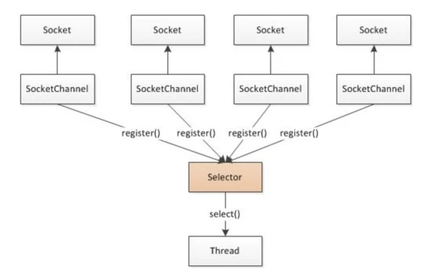

# network

#### 介绍
网络调试助手，基于IO多路复用实现。

#### 使用说明

1. 服务端
2. 客户端

#### NIO用法详解
Java NIO主要由三个组件组成：Channel、Selector和Buffer。关于这三个组件的作用主要如下：

* Channel是客户端连接的一个抽象，当每个客户端连接到服务器时，服务器都会为其生成一个Channel对象；
* Selector则是Java NIO实现高性能的关键，其本质上使用了IO多路复用的原理，通过一个线程不断的监听多个Channel连接来实现多所有这些Channel事件进行处理，这样的优点在于只需要一个线程就可以处理大量的客户端连接，当有客户端事件到达时，再将其分发出去交由其它线程处理；
* Buffer从字面上讲是一个缓存，本质上其是一个字节数组，通过Buffer，可以从Channel上读取数据，然后交由下层的处理器进行处理。这里的Buffer的优点在于其封装了一套非常简单的用于读取和写入数据Api。
关于Channel和Selector的整体结构，可以通过下图进行的理解，这也是IO多路复用的原理图：

##### 1.核心API

1.1、 Channel 其主要的api如下：

<pre>
    <code>
// 服务器端：
// 用于创建一个供服务器使用的ServerSocketChannel实例
ServerSocketChannel.open();
// 绑定一个服务器端口，从而提供对外的服务
ServerSocketChannel.bind();
// 获取一个客户端的Channel连接
ServerSocketChannel.accept();

// 客户端：
// 用于创建一个供客户端使用的SocketChannel实例
SocketChannel.open();
// 连接参数中指定地址和端口对应的服务器
SocketChannel.connect();

//ServerSocketChannel和SocketChannel两者兼备的方法
// 用于指定服务器处理请求的方式是阻塞的还是非阻塞的，对于JavaNIO都是以非阻塞的方式进行处理的
Channel.configureBlocking();
// 将当前channel注册到一个Selector上，该方法会返回注册之后得到的SelectionKey对象。
// 这里在注册Channel的时候可以选择Selector将关注该Channel的哪些事件，可选的有如下几种：
// SelectionKey.OP_CONNECT：监听Channel建立连接事件
// SelectionKey.OP_READ：监听Channel的可读取事件，也即客户端已经发送数据过来，此时可以读取
// SelectionKey.OP_WRITE：监听Channel的可写事件，即当前可以写入数据到Channel中
Channel.register(Selector,int);
    </code>
</pre>

1.2、 Selector 其主要的api如下：

<pre>
    <code>
// 创建一个Selector实例
Selector.open();
// 监听所有注册的Channel，一直阻塞知道有任何一个客户端Channel有相应的事件到达，
// 需要注意的是，这里的select()方法返回的是当前接收到是事件数目，而不是具体的事件，
// 具体的事件要通过selectedKeys()方法获取
Selector.select();
// 获取当前所有有事件到达的客户端Channel对应的SelectionKey实例
Selector.selectedKeys();
    </code>
</pre>

1.3、 SelectionKey 其主要的api如下：

<pre>
    <code>
// 判断当前收到的Channel的事件是否为OP_CONNECT事件
SelectionKey.isConnectable();
// 判断当前收到的Channel的事件是否为OP_READ事件
SelectionKey.isReadable();
// 判断当前收到的Channel的事件是否为OP_WRITE事件
SelectionKey.isWritable();
// 返回当前SelectionKey中所封装的Channel对象
SelectionKey.channel();
    </code>
</pre>

 从上面的API中可以看出，这里关于Channel处理的大致流程是，首先由SocketChannel或者ServerSocketChannel调用open()方法创建一个Channel对象；
然后调用Channel.register()方法将当前Channel注册到Selector中；接着通过Selector.select()方法监听所有注册的Channel的连接，如果有任何一个
有事件到达，此时这些事件会封装到当前客户端Channel对应的SelectionKey中，最后通过SelectionKey判断具体是什么类型的事件，然后对这些事件进
行处理。

##### 2.用法示例

2.1、服务端示例

<pre>
    <code>
public class Server {

  public static void main(String[] args) throws IOException {
    new Server().start();
  }

  private void start() throws IOException {
    // 创建一个服务器ServerSocketChannel对象
    ServerSocketChannel serverSocketChannel = ServerSocketChannel.open();
    // 将当前服务器绑定到8080端口
    serverSocketChannel.bind(new InetSocketAddress(8080));
    // 设置当前channel为非阻塞的模式
    serverSocketChannel.configureBlocking(false);

    // 创建一个Selector对象
    Selector selector = Selector.open();
    // 将服务器ServerSocketChannel注册到Selector上，并且监听与客户端建立连接的事件
    serverSocketChannel.register(selector, SelectionKey.OP_ACCEPT);
    while (true) {
      // 监听ServerSocketChannel上的事件，每秒钟循环一次，
      // 这里select()方法返回的是当前监听得到的事件数目，为0表示当前没有任何事件到达
      if (selector.select(1000) == 0) {
        System.out.println("has no message...");
        continue;
      }

      // 走到这里说明当前有监听的事件到达，获取所有监听的Channel所对应的SelectionKey对象，
      // 这里需要注意的是，前面我们已经将ServerSocketChannel注册到Selector中了，
      // 因而对于ServerSocketChannel，其监听得到的则是SelectionKey.OP_CONNECT事件。
      // 但是下面的代码中，我们也会将与客户端建立的连接Channel注册到Selector中，
      // 因而这里Selector中也会存在接收到的SelectionKey.OP_READ和OP_WRITE事件。
      Set<SelectionKey> selectionKeys = selector.selectedKeys();
      // 对监听到的事件进行遍历
      Iterator<SelectionKey> iterator = selectionKeys.iterator();
      while (iterator.hasNext()) {
        SelectionKey key = iterator.next();
        // 这里需要注意的是，Selector在为每个有事件到达的Channel建立SelectionKey对象
        // 之后，其并不会将其移除，如果我们不进行移除，那么下次循环时该事件还会再被处理一次，
        // 因而这里要调用remove()方法移除该SelectionKey
        iterator.remove();

        // 如果是有新的客户端Channel连接建立，则处理该事件
        if (key.isAcceptable()) {
          accept(key, selector);
        }

        // 如果客户端连接中有可读取的数据，则处理该事件
        if (key.isReadable()) {
          read(key);
        }

        // 如果可往客户端连接中写入数据，则处理该事件
        if (key.isValid() && key.isWritable()) {
          write(key);
        }
      }
    }
  }

  private void accept(SelectionKey key, Selector selector) throws IOException {
    // 这里由于只有ServerSocketChannel才会有客户端连接建立事件，因而这里可以直接将
    // Channel强转为ServerSocketChannel对象
    ServerSocketChannel serverChannel = (ServerSocketChannel) key.channel();
    // 获取客户端的连接
    SocketChannel socketChannel = serverChannel.accept();
    socketChannel.configureBlocking(false);
    // 将客户端连接Channel注册到Selector中，并且监听该Channel的OP_READ事件，
    // 也即等待客户端发送数据到服务器端
    socketChannel.register(selector, SelectionKey.OP_READ);
  }

  private void read(SelectionKey key) throws IOException {
    // 这里只有客户端才会发送数据到服务器，因而可将其强转为SocketChannel对象
    SocketChannel clientChannel = (SocketChannel) key.channel();
    ByteBuffer buffer = ByteBuffer.wrap(new byte[1024]);
    // 从客户端Channel中读取数据，这里read()方法返回读取到的数据长度，
    // 如果为-1，则表示客户端断开连接了
    int len = clientChannel.read(buffer);
    if (len == -1) {
      clientChannel.close();
      return;
    }

    // 处理客户端数据
    System.out.println("**********server: read message**********");
    System.out.println(new String(buffer.array(), 0, len));
    // 由于已经读取了客户端数据，因而这里将对该Channel感兴趣的事件修改为
    // SelectionKey.OP_READ	和OP_WRITE，用于服务器往该Channel中写入数据
    key.interestOps(SelectionKey.OP_READ | SelectionKey.OP_WRITE);
  }

  private void write(SelectionKey key) throws IOException {
    String message = "message from server";
    ByteBuffer buffer = ByteBuffer.wrap(message.getBytes());
    // 由于上面为客户端Channel设置了可供写入数据的事件，因而这里可以往客户端Channel写入数据
    SocketChannel clientChannel = (SocketChannel) key.channel();

    if (clientChannel.isOpen()) {
      System.out.println("**********server: write message**********");
      System.out.println(message);
      // 往客户端Channel写入数据
      clientChannel.write(buffer);
    }

    // 写入完成后，监听客户端会继续发送的数据
    if (!buffer.hasRemaining()) {
      key.interestOps(SelectionKey.OP_READ);
    }

    buffer.compact();
  }
}
    </code>
</pre>

2.2、 客户端示例

<pre>
    <code>
public class Client {

  public static void main(String[] args) throws IOException {
    new Client().start();
  }

  private void start() throws IOException {
    // 创建一个客户端SocketChannel对象
    SocketChannel channel = SocketChannel.open();
    // 设置客户端Channel为非阻塞模式
    channel.configureBlocking(false);
    
    // 创建一个供给客户端使用的Selector对象
    Selector selector = Selector.open();
    // 注册客户端Channel到Selector中，这里客户端Channel首先监听的是OP_CONNECT事件，
    // 因为其首先必须与服务器建立连接，然后才能发送和读取数据
    channel.register(selector, SelectionKey.OP_CONNECT);
    // 调用客户端Channel.connect()方法连接服务器，需要注意的是，该方法的调用必须放在
    // 上述Channel.register()方法之后，否则在注册之前客户端就已经注册完成，
    // 此时Selector就无法收到SelectionKey.OP_CONNECT事件了
    channel.connect(new InetSocketAddress("127.0.0.1", 8080));
    while (true) {
      // 监听客户端Channel的事件，这里会一直等待，直到有监听的事件到达。
      // 对于客户端，首先监听到的应该是SelectionKey.OP_CONNECT事件，
      // 然后在后续代码中才会将SelectionKey.OP_READ和WRITE事件注册
      // 到Selector中
      selector.select();
      Set<SelectionKey> selectionKeys = selector.selectedKeys();
      Iterator<SelectionKey> iterator = selectionKeys.iterator();
      while (iterator.hasNext()) {
        SelectionKey key = iterator.next();
        iterator.remove();
          
        // 监听到客户端Channel的SelectionKey.OP_CONNECT事件，并且处理该事件
        if (key.isConnectable()) {
          connect(key, selector);
        }

        // 监听到客户端Channel的SelectionKey.OP_WRITE事件，并且处理该事件
        if (key.isWritable()) {
          write(key, selector);
        }

        // 监听到客户端Channel的SelectionKey.OP_READ事件，并且处理该事件
        if (key.isReadable()) {
          read(key);
        }
      }
    }
  }
  
  private void connect(SelectionKey key, Selector selector) throws IOException {
    // 由于是客户端Channel，因而可以直接强转为SocketChannel对象
    SocketChannel channel = (SocketChannel) key.channel();
    channel.finishConnect();
    // 连接建立完成后就监听该Channel的WRITE事件，以供客户端写入数据发送到服务器
    channel.register(selector, SelectionKey.OP_WRITE);
  }
    
  private void write(SelectionKey key, Selector selector) throws IOException {
    SocketChannel channel = (SocketChannel) key.channel();
    String message = "message from client";
    System.out.println("**********client: write message**********");
    System.out.println(message);
    // 客户端写入数据到服务器Channel中
    channel.write(ByteBuffer.wrap(message.getBytes()));
    // 数据写入完成后，客户端Channel监听OP_READ事件，以等待服务器发送数据过来
    channel.register(selector, SelectionKey.OP_READ);
  }

  private void read(SelectionKey key) throws IOException {
    System.out.println("**********client: read message**********");
    SocketChannel channel = (SocketChannel) key.channel();
    ByteBuffer buffer = ByteBuffer.wrap(new byte[1024]);
    // 接收到客户端Channel的SelectionKey.OP_READ事件，说明服务器发送数据过来了，
    // 此时可以从Channel中读取数据，并且进行相应的处理
    int len = channel.read(buffer);
    if (len == -1) {
      channel.close();
      return;
    }

    System.out.println(new String(buffer.array(), 0, len));
  }
}
    </code>
</pre>

2.3、 运行结果

服务端：
<pre>
    <code>
has no message...
has no message...
has no message...
has no message...
**********server: read message**********
message from client
**********server: write message**********
message from server
    </code>
</pre>

客户端：
<pre>
    <code>
**********client: write message**********
message from client
**********client: read message**********
message from server
    </code>
</pre>